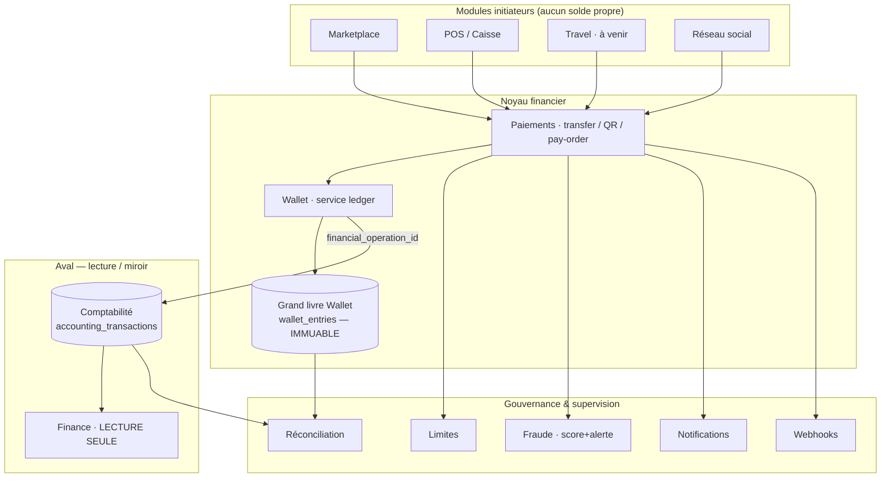
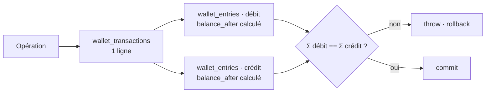
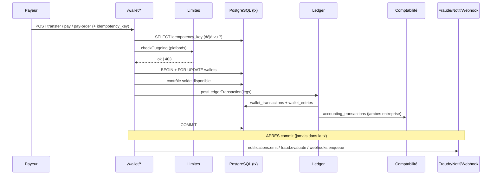
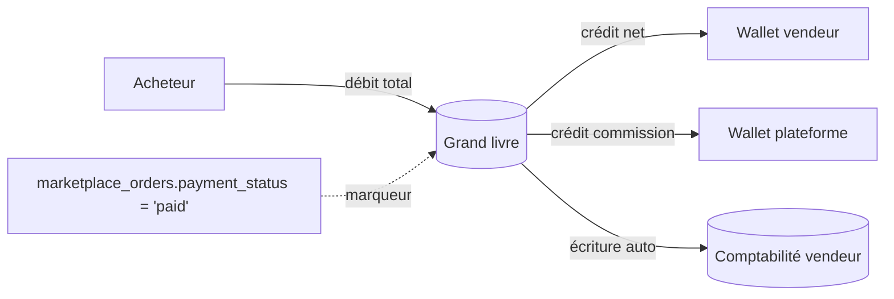
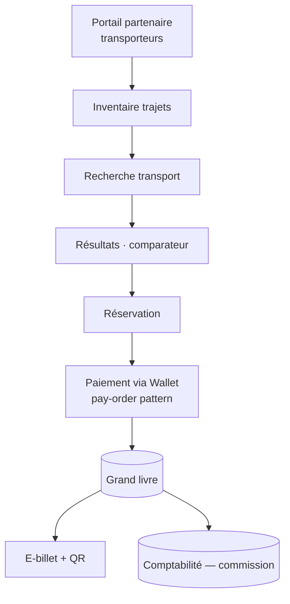
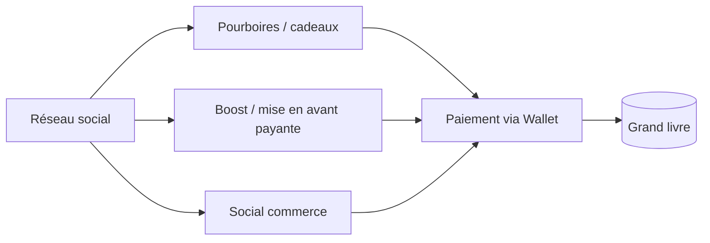

# MaliLink — Architecture du domaine financier

> Documentation technique de référence. État au 2026-07-21, après le renfort
> du moteur Wallet (migrations `051`→`055`, services `wallet-*`).
> Portée : Wallet, Paiements, Grand livre, Comptabilité, Finance, Marketplace,
> POS, Travel (à venir), Réseau social, Notifications, Webhooks.

---

## 1. Vue d'ensemble et dépendances

Le domaine financier est organisé autour d'un **noyau unique** — le grand
livre Wallet (`wallet_entries`, immuable) — dont **tous** les mouvements
internes découlent. Les modules métier (Marketplace, POS, Travel, Social)
sont des **initiateurs** d'opérations : ils appellent le moteur, mais ne
tiennent aucun solde propre. La Comptabilité reçoit une écriture
automatique par opération ; la Finance ne fait que **lire**.

**Règle de dépendance :** les flèches vont toujours *vers* le noyau, jamais
l'inverse. Un module métier ne lit ni n'écrit `wallet_entries` directement ;
il passe par `services/wallet-ledger.js`.

---

## 2. Source unique de vérité

| Donnée | Source unique | Nature | Duplication ? |
|---|---|---|---|
| **Soldes Wallet** | `wallet_entries.balance_after` (dernière écriture) | Dérivée, immuable | Aucune. `wallets` n'a **pas** de colonne `balance`. |
| **Mouvements internes** | `wallet_entries` | Immuable (jamais UPDATE/DELETE) | Aucune. |
| **Transactions** | `wallet_transactions` (1 par opération) | `reference` + `idempotency_key` uniques | Aucune. |
| **Commissions** | `wallet_transactions.commission_amount` + jambe crédit du wallet plateforme | Double-entrée équilibrée | Aucune. |
| **Lien Wallet ↔ Compta** | `financial_operation_id` (partagé) | Clé de corrélation | — |

**Frontière à connaître — deuxième système de solde (légitime, distinct) :**
le module comptable classique d'entreprise gère des **soldes mutables**
`accounting_banks.current_balance` et `treasury_accounts.current_balance`.
Ils représentent les **comptes bancaires réels et la trésorerie externe**
d'une entreprise (comptabilité traditionnelle Triangle/MaliLink Business),
**pas** l'argent interne du Wallet. Ce sont deux périmètres qui ne doivent
jamais revendiquer le même argent :

- Wallet = monnaie interne MaliLink (circuit fermé, grand livre immuable).
- `accounting_banks` / `treasury_accounts` = reflet des comptes externes,
  saisis/ajustés par la comptabilité (running balance mutable, protégé par
  `SELECT ... FOR UPDATE` + `ensureSufficientBalance`).

> **Recommandation :** documenter explicitement cette frontière dans le code
> et, à terme (Lot 7 Wallet Business), faire converger le solde Wallet
> entreprise vers le grand livre plutôt que vers un running balance mutable.

---

## 3. Grand livre — invariants

- **Équilibre obligatoire** : `postLedgerTransaction` rejette toute
  opération où `Σ débits ≠ Σ crédits` (tolérance au centime).
- **Immuabilité** : `wallet_entries` n'est jamais modifié. Une correction
  se fait par **écriture compensatoire**, jamais par UPDATE.
- **Atomicité** : `BEGIN` → verrous `FOR UPDATE` (ordre d'id stable,
  anti-deadlock) → contrôle de solde → écritures → `COMMIT`.
- **Idempotence** : `idempotency_key` UNIQUE ⇒ un rejeu ne débite jamais
  deux fois.

---

## 4. Flux de paiement

Les traitements de gouvernance (fraude, notifications, webhooks) s'exécutent
**après** le `COMMIT` pour ne pas allonger la transaction ni tenir les
verrous. Ils sont *best-effort* : une erreur n'annule jamais un paiement
déjà validé.

---

## 5. Marketplace (paiement + commission)

- `POST /wallet/pay-order/:orderId` — idempotent par commande
  (`order-pay-<id>`).
- Commission = `MALILINK_COMMISSION_RATE` (5 % par défaut), prélevée
  automatiquement vers le wallet plateforme.
- `marketplace_orders.payment_status` est un **marqueur d'état**, pas une
  source de solde. `marketplace_payments` (legacy) sert aux méthodes
  hors-Wallet ⇒ **cible de consolidation** (voir §10).

---

## 6. Travel — architecture cible (Lot 4)

Travel réutilise **strictement** le moteur Wallet (aucun solde propre) :
réservation → `postLedgerTransaction` (débit voyageur / crédit transporteur
net + commission plateforme) → e-billet signé (même mécanique HMAC+QR que
les reçus).

---

## 7. Réseau social — points d'ancrage financiers

Le social est aujourd'hui non financier (profils, découverte, posts,
messagerie). Ses futures monétisations (pourboires, boosts, social commerce)
passeront elles aussi par le Wallet — jamais de portefeuille parallèle.

---

## 8. Sécurité (synthèse)

| Contrôle | État | Détail |
|---|---|---|
| **JWT** | ✓ | HS256, scоpé par tenant, expiration 1 j. Refus au démarrage si `JWT_SECRET` absent en production. |
| **Permissions** | ✓ | `authenticateToken` + `isSuperAdminUser` sur les endpoints admin ; anti-IDOR (un user ne voit que son wallet). |
| **Idempotence** | ✓ | `idempotency_key` UNIQUE, vérifié avant et garanti par contrainte DB. |
| **Injection SQL** | ✓ | 100 % paramétré (`$1,$2…`) dans le code financier ; aucune interpolation `${}` dans les requêtes. |
| **Race conditions** | ✓ | `FOR UPDATE` en ordre d'id stable (anti-deadlock). |
| **Double paiement** | ✓ | Idempotence + verrou + contrôle de solde intra-transaction. |
| **Replay** | ✓ | Idempotency keys ; reçus signés HMAC ; webhooks signés + horodatés. |
| **Secrets** | ⚠ | Secrets webhooks stockés en clair en base ; `RECEIPT_SECRET` retombe sur `JWT_SECRET`. À isoler (§10). |
| **Webhooks** | ✓ | HMAC-SHA256, désactivés par défaut, secret jamais ré-exposé après création. |
| **Audit logs** | ✓ | `wallet_audit_logs`, `wallet_card_audit_logs`, revue des alertes fraude tracée. |

---

## 9. Scalabilité & performance

### Goulots par palier

| Palier | Risque principal | Action |
|---|---|---|
| **100 000** | Pool PG par défaut (max 10) | Fixer `max` (20–30) ; index manquants (ci-dessous). |
| **500 000** | Rate-limiter en mémoire (Map, non partagé) ; réconciliation full-scan | Rate-limit Redis ; réconciliation incrémentale + PgBouncer. |
| **1 000 000** | Croissance illimitée de `wallet_entries` ; traitements synchrones | Partitionnement `wallet_entries` par mois ; file d'attente réelle (queue) pour notifs/webhooks ; PM2 cluster + instances stateless. |

### Index manquants (priorité)

| Priorité | Index proposé | Justification |
|---|---|---|
| **Haute** | `wallet_entries(transaction_id)` | Utilisé par reçu, vérif publique et réconciliation (JOIN + SUM) — actuellement seq scan. |
| Moyenne | `wallet_transactions(initiated_by, created_at DESC)` | Contexte fraude (`buildContext`) + historique. |
| Moyenne | `wallet_fraud_alerts(user_id)` | Recherche d'alertes par utilisateur. |
| Basse | GIN sur `wallet_webhooks(events)` | Filtre `event = ANY(events)` quand beaucoup de webhooks. |

### N+1 & transactions longues

- `postLedgerTransaction` boucle sur les jambes (`currentBalance` par jambe) :
  **borné à 2–3 jambes**, non problématique.
- Aucune transaction longue : la gouvernance est post-commit.
- `buildContext` (fraude) = quelques requêtes par opération, acceptable ;
  à surveiller si le volume explose (mettre en cache / échantillonner).

---

## 10. Dettes & recommandations avant montée en charge

1. **Index** `wallet_entries(transaction_id)` — quick win, forte valeur.
2. **Pool PG** : définir `max`, `idleTimeoutMillis`, `connectionTimeoutMillis`.
3. **Rate-limit distribué** (Redis) dès le passage multi-instances.
4. **Secrets** : sortir les secrets webhooks/receipt d'un stockage clair
   (chiffrement au repos ou coffre) et dissocier `RECEIPT_SECRET` de `JWT_SECRET`.
5. **Réconciliation incrémentale** + tâche planifiée (cron) au lieu d'un
   full-scan à la demande.
6. **File d'attente** réelle pour notifications & livraisons webhooks.
7. **Consolidation** `marketplace_payments` / `pay-order` : une seule
   représentation du paiement marketplace.
8. **Frontière Wallet ↔ comptabilité bancaire** documentée et testée
   (aucun double comptage).

---

## 11. Référentiel des composants

### Services (`backend/services/`)
| Fichier | Rôle |
|---|---|
| `wallet-ledger.js` | Moteur double-entrée — **source de vérité unique** des mouvements. |
| `wallet-limits.js` | Plafonds (opération / jour / mois / nombre). |
| `wallet-fraud.js` | Score de risque + alerte (jamais de blocage auto). |
| `wallet-notifications.js` | Notifications financières multi-canal (in-app garanti). |
| `wallet-webhooks.js` | Événements sortants signés HMAC (désactivés par défaut). |
| `wallet-reconciliation.js` | Contrôle d'équilibre + Wallet ↔ Comptabilité. |
| `wallet-currency.js` | Référentiel multi-devises (XOF actif ; EUR/USD prêts). |

### Migrations financières
`051` Wallet · `052` Budgets Finance · `053` Cartes virtuelles ·
`054` Paiements QR + finop + compta auto · `055` Renfort (limites,
devises, notifications, fraude, webhooks, réconciliation).

### API publique versionnée
`GET /wallet/v1/docs` · `GET /wallet/v1/currencies` ·
`GET /wallet/v1/public/verify-receipt/:reference`.

### Événements webhooks
`transaction.completed` · `payment.received` (signés
`X-MaliLink-Signature`, HMAC-SHA256 du corps JSON).

---

## 12. Ordre de développement recommandé

L'ordre proposé par le pilote est validé, avec une **phase 0 de durcissement**
insérée avant le Lot 3 (les 8 dettes du §10, dont l'index critique).

0. **Durcissement** (court) — index, pool, secrets, frontière Wallet/compta.
1. **Lot 3** — Administration Wallet + connecteurs de paiement (flags OFF).
2. **Lot 4** — Travel (bus/avion/taxi, e-billets QR, commission via Wallet).
3. **Lot 5** — Réseau social vidéo.
4. **Lot 6** — Emploi & recrutement.
5. **Lot 7** — Wallet Business (convergence solde entreprise → grand livre).
6. **Lot 8** — API publiques & SDK.
